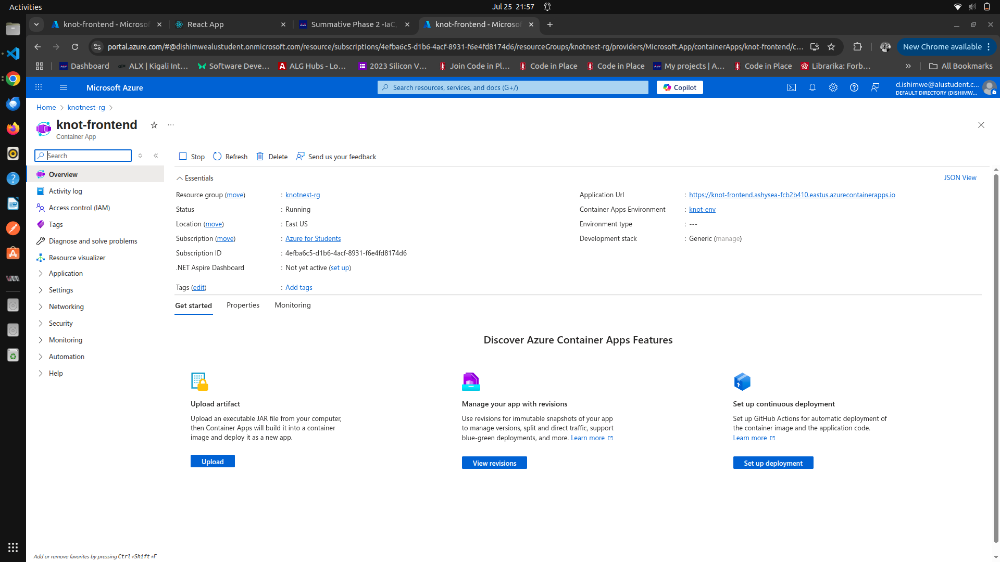

## Live public url

Live Application URL : https://knot-frontend.ashysea-fcb2b410.eastus.azurecontainerapps.io/

## Screenshots

## Link to the pull request

## Challenges

One of the main challenge I faced during
this activity was pushing my code to to github after setting up docker and terraform
. I encoutered errors related to large files and unneccessary folder beign tracked . And for the first time i thought my github has some issues . To fix this i added a proper .gitngore file and committed only the essential proejct files.

Also with terraform was also new to me , and it took me sometime to understand how to configure the Azure resourcer corrently . After several trials i was able succefully delpy all resources
